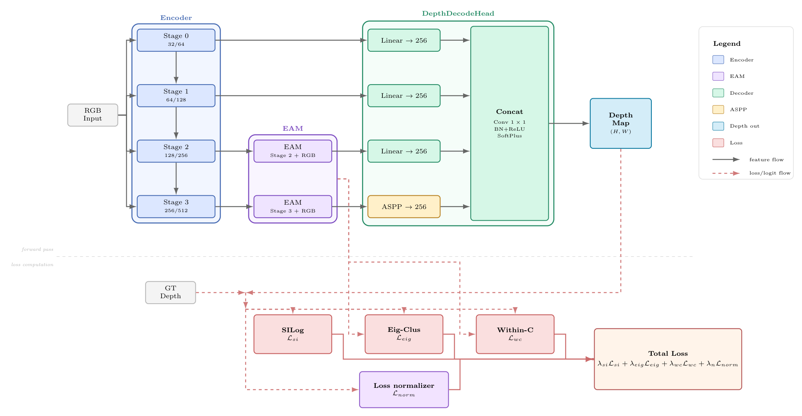
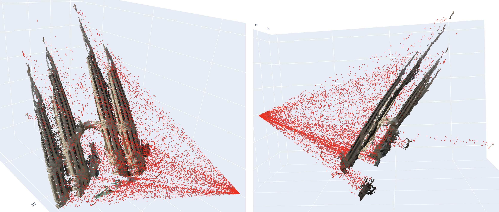

# Spectral-Guided Lightweight Depth Estimation

While foundation models achieve high-fidelity monocular depth estimation, their computational weight precludes deployment on edge devices. Conversely, lightweight models often suffer from "depth bleeding" at occlusion boundaries due to their limited receptive fields. We propose a compact 1.3M parameter framework that bridges unsupervised spectral object discovery with supervised geometric regression. We provide the first adaptation of EAGLE—a spectral framework originally designed for Transformers—to convolutional backbones. By augmenting the encoder with Atrous Spatial Pyramid Pooling (ASPP), we recover the expansive receptive fields required for accurate spectral affinity computation within a convolutional regime, and an Eigen-Guided Decoder integrates the resulting object boundaries into the upsampling hierarchy to mitigate boundary artifacts.

## Architecture



The encoder's multi-stage features feed two paths. The **DepthDecodeHead**
projects each stage (`Linear → 256`, with an `ASPP → 256` block on the deepest
stage), concatenates them (`Conv 1×1` + `BN+ReLU`), and applies SoftPlus to
produce a metric depth map. In parallel, the **EAGLE EigenAggregation Modules
(EAM)** attach at the deeper stages (fed the stage features + RGB) and produce
spectral cluster assignments that drive the auxiliary losses only — they never
modify the decoder feature path. The total loss is a weighted sum of the
**SILog** depth term, the **eigen-cluster** term (`L_eig`), the
**within-cluster** planar-consistency term (`L_wc`), and a loss-normaliser term.

## What we did

- Built a sparse-LiDAR depth pipeline on the course dataset, including a DROR
  point-cloud de-noiser to clean the training GT (`scripts/clean_gt.py`).
- Implemented EAGLE's EiCue spectral module (`EigenAggregationModule`) and its
  two auxiliary losses (eigen-cluster + within-cluster consistency), plus a
  virtual-normal loss, all sharing one set of building blocks
  (`scripts/losses.py`).
- Trained and ablated **four backbones** — MobileNetV3, SegFormer-B0,
  MobileViT-XXS, and ResNet34 — each with the same scratch → base → +ASPP →
  +EAGLE → +VN progression.
- Evaluated cross-dataset generalisation on **NYUv2 / KITTI / ETH3D**
  (`benchmarks/`).

The chosen approach is **MobileNet** (`approaches/Mobilenet/`): the full
MobileNetV3 + ASPP + EAGLE + virtual-normal model.

## Repository layout

```
.
├── scripts/        # approach-independent shared code
│                   #   constants.py (dataset paths), losses.py, metrics.py,
│                   #   pointcloud.py, visualize_depth.py, clean_gt.py
├── benchmarks/     # NYUv2 / KITTI / ETH3D cross-dataset evaluation
└── approaches/     # one folder per backbone, each self-contained
    ├── Mobilenet/  # chosen approach — includes trained checkpoints
    ├── Segformer/
    ├── Mobilevit/
    └── Resnet/
```

Each approach has a `README.md` listing its experiments, a `model.py`, and
`train/`, `inference/`, `results/` subfolders. See the per-approach READMEs for
exact commands.

## Pointcloud predictions

We ship **interactive 3D pointcloud predictions as standalone `.html` files** —
open them in any browser to orbit/zoom the predicted scene. We choose the first 8 images
of the train set, as we held them out during training to have a ground-truth to compare
with. The ground-truth point clouds are under `assets/`. The MobileNet
predictions are committed under
`approaches/Mobilenet/results/pointclouds/*.html`. Generate your own from any
depth `.npy` + RGB with:

```bash
python -m scripts.pointcloud path/to/depth.npy path/to/rgb.png --out cloud.html
```

The same back-projection underpins our DROR ground-truth cleaning
(`scripts/clean_gt.py`): below, two views of a back-projected LiDAR scene with
kept points in grey and the outliers removed by DROR in red.



## Reproducing the results

All commands are run from the repository root (this folder).

1. **Install dependencies** (Python 3.11, CUDA GPU recommended):
   ```bash
   pip install -r requirements.txt
   ```
2. **Point at the dataset.** Defaults target the course cluster
   (`/cluster/courses/cil/monocular-depth-estimation/{train,test}`). Override
   via environment variables consumed by `scripts/constants.py`:
   ```bash
   export CIL_DATA_ROOT=/path/to/monocular-depth-estimation
   export CIL_CLEANED_GT_DIR=/path/to/train_depth_clean
   ```
3. **(Optional) Clean the training GT** used by the cleaned-GT experiments:
   ```bash
   python -m scripts.clean_gt --workers 8
   ```
4. **Train an approach** (example: the chosen MobileNet top-line model):
   ```bash
   bash approaches/Mobilenet/train/experiments/base_aspp_eagle_vn.sh
   # or all five experiments (slurm, idempotent):
   bash approaches/Mobilenet/train/experiments/run_all.sh
   ```
5. **Run inference / build the submission CSV:**
   ```bash
   python -m approaches.Mobilenet.inference.inference \
       --ckpt approaches/Mobilenet/results/checkpoints/best.pth \
       --out_dir approaches/Mobilenet/results/predictions
   ```

The MobileNet approach ships trained per-epoch checkpoints under
`approaches/Mobilenet/results/checkpoints/`, so you can run inference and
visualisation without retraining.

## Use of generative AI
We used Claude Code to refactor the codebase, since our original project contained some unintuitive file namings and monolithic code. Claude Code also added docstrings to make the Code more accessible for first-time users.
